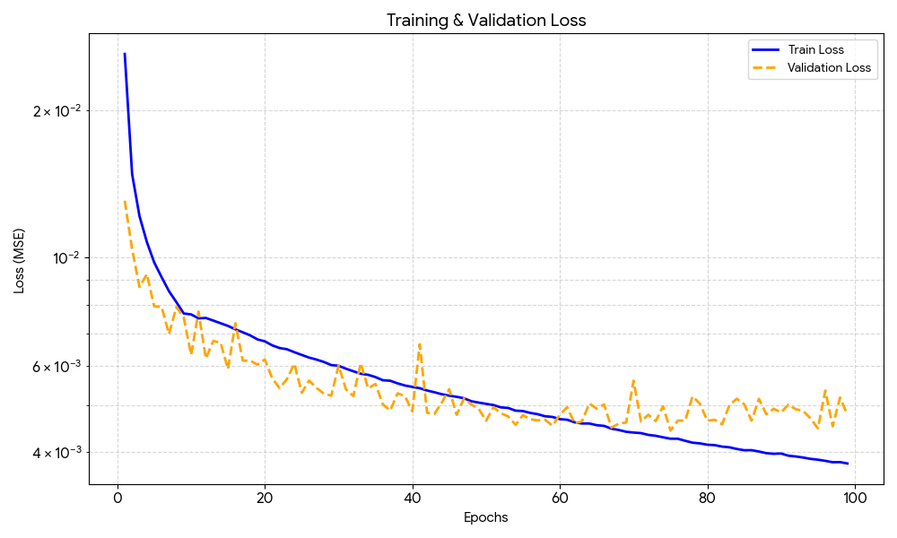

# Validating completion of the first "Must"
> **Must** understand the functionality of the TLIO model (GitHub - CathIAS/TLIO: Tight Learned Inertial Odometry) and be able to install the environment on Linux operating system and train the model, with the provided code on a given dataset
The results located in this directory confirm the completion of the first "Must". They align with our approach in the Project Plan as they closely resemble the findings illustrated in the paper. 

We have logs, figures and the saved model to show that we were able to train (in [Model](./Model)), test (in [Test_Results](./Test_Results)) and run the EKF (in [EKF_Results](./EKF_Results)). We have chosen the Delft Blue supercomputer specifically because it runs on Red Hat Enterprise **Linux** 8. 

**Training and validation plot:**

