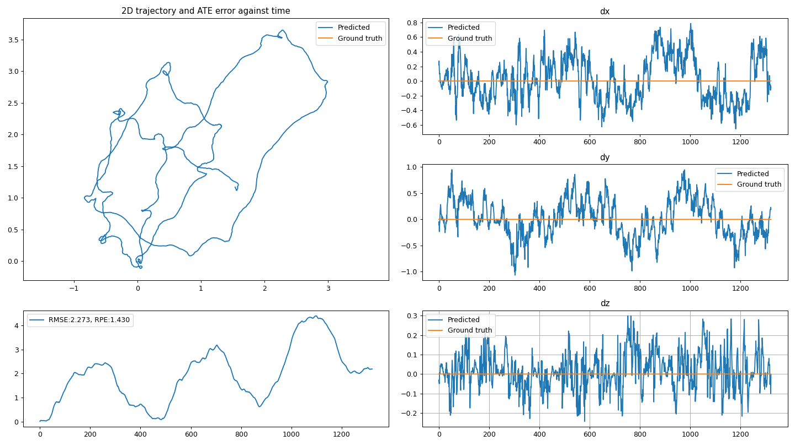
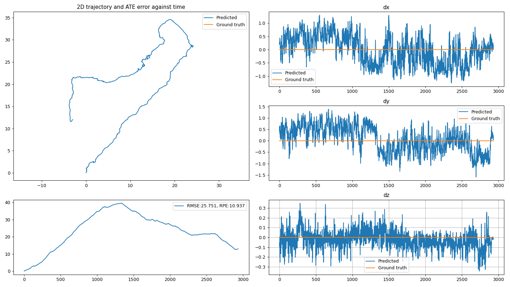
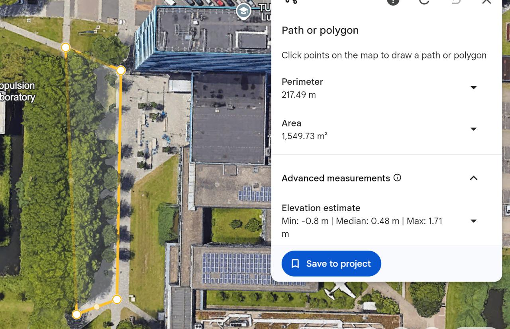

# Validation of first Could requirement
> **Could** gather experimental data with an IMU on a smartphone to analyze the robustness of the TLIO model

This experiment entails walking in a rectangular pattern multiple times, both clockwise (CW) and counter clockwise (CC). Upon completion of this experiment it can be seen that the first 2 times are somewhat close to one another, however the trajectory predicted on the third trip begins to diverge quite far away from the original. This can be attributed to severe sensor drift accumulation. Additional trials reveal the same behaviour: [view-rect1-CC](./view-rect1-CC.png), [view-rect2-CC](./view-rect2-CC.png), [view-rect1-CW](./view-rect1-CW.png) and [view-rect2-CW](./view-rect2-CW.png).

**Results:**

One interesting observation is that the model can work to some extent even outdoors in the absence of severe perturbations. The predicted trajectory does seem to diverge from the original path, ending up more than 10 meters away from the starting point. 
| **Model Prediction** | **Actual Path** |
|:---:|:---:|
|  |  |
| *Note the spikes in vertical displacement (dy) indicating steps.* | *Display of actual path (yellow polygon) taken by the device.* |
