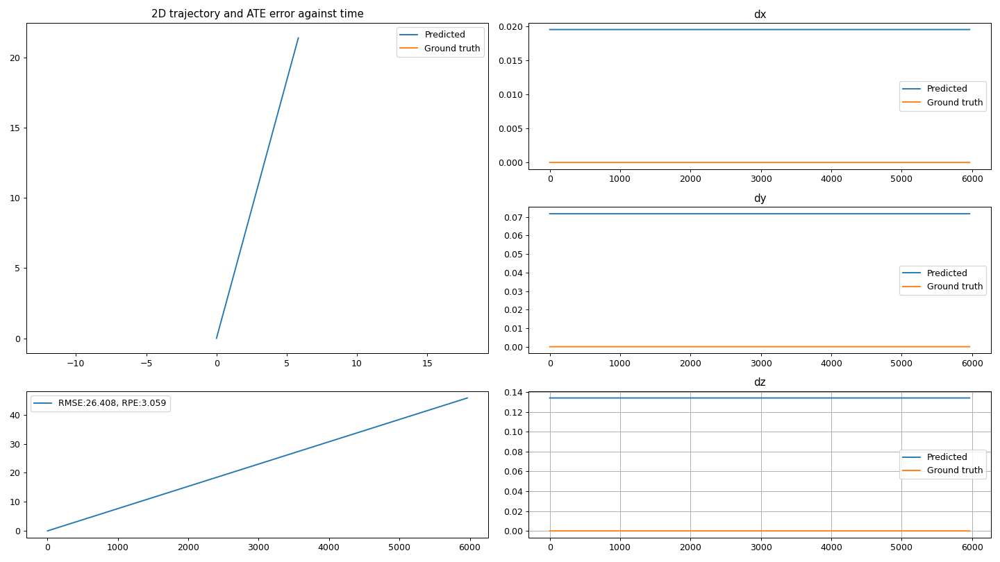
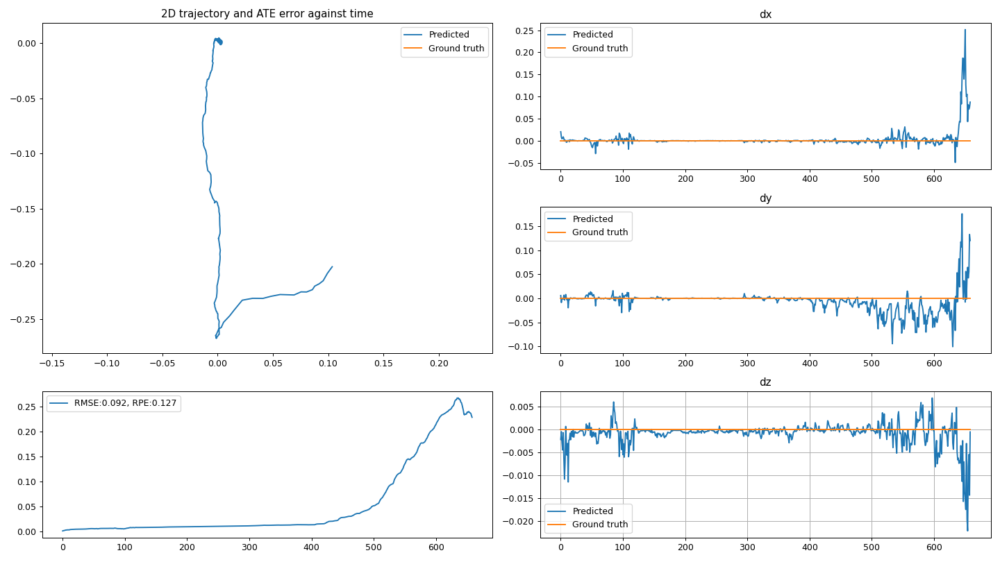

# Validation of second Must requirement
> **Must** be able to synthesize their own simulated accelerometer and gyroscope data which demonstrate different types of motion i.e., a wheeled robot, a human walking, a flying drone etc.

We were able to simulate running data with the help of [Synthetic data running.py](./Synthetic-data-running.py). We consider the Y-axis to align with the gravity vector, thus the XZ-plane is host to the horizontal movement plane. 
Along the Y-axis we have a bobbing motion and in the ZX-plane a constant acceleration that only acts along one of the axes. 

# Validation of third Must requirement 
> **Must** analyze the performance gain by including the TLIO model based on the synthetic data.

To validate this requirement we have recorded while standing still and also created a new file that should simulate this (constant acceleration only along Y-axis). The results can be observed in the "view-still_SYNTH" and "view-still_exp" files. The model performs considerably worse on our simulated data, the Relative Pose Error (RPE) being nearly 30 times higher for the synthetic data. One explanation for this is that we cannot replicate genuine organic movement specific to a human. To get better data, more sophisticated software is required.

> **Note:** The obtained csv files must be run through "custom_script_indoors-data.py" to get the corresponding npy file as well as the appropriate data to put in the JSON description file. In case the sampling is 100Hz or lower, the file needs to be upsampled to 200Hz for the model to work properly. 

| **Synthetic Data Prediction** | **Experimental Data Prediction** |
|:---:|:---:|
|  |  |
| *Note the constant movement predicted by the model.* | *The RPE is much lower in this case (<20cm).* |
